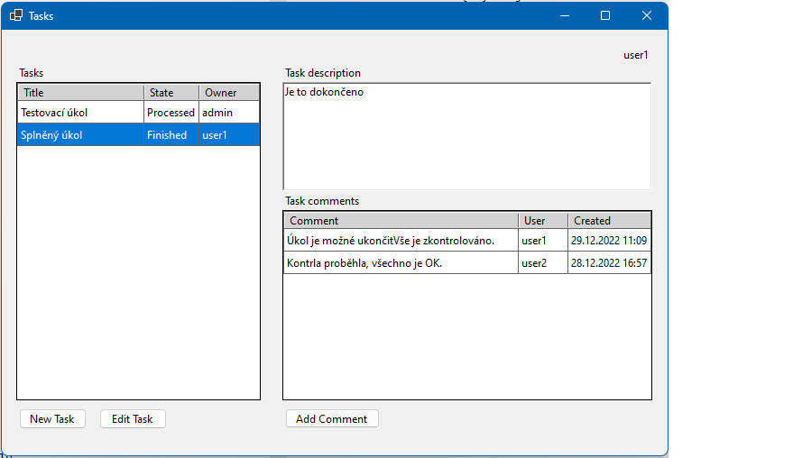
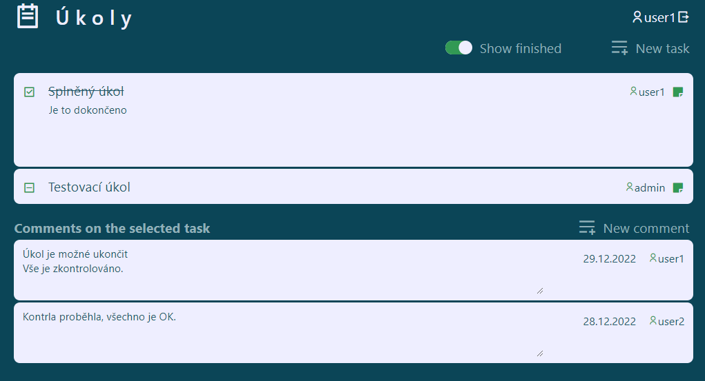

# TasksApp

Ukázková aplikace pro výuku C#, NeET Core, Rest API, WinForm a frameworku Blazor

## Vývojové prostředí

Pro vývoj bylo použito Visual studio ve verzi 17.4.0

Pro obě části je použit .Net Framewor 7.0

## Serverová část

Projekt TaskAPI poskytuje REST API rozhraní pro práci s daty.

K vytvoření je použito [ASP.NET Core Minimal APIs](https://learn.microsoft.com/en-us/aspnet/core/fundamentals/minimal-apis?view=aspnetcore-7.0)

Rest API rozhraní běží na adrese: `http://localhost:5050/`

### Datový model

Pro práci s daty je použit `Microsoft.EntityFrameworkCore.InMemory`

**Úkoly:**

```
MyTask

    int Id (primary key)

    string Title

    string Description

    string State (enum {New, Processed, Finished, Deleted})

    string Owner
```

Api endpoints:

```
    Get:	"tasks/" - všechny úkoly bez úkolů ve stavu Deleted

    Get:	"tasks/incdel" - všechny úkoly

    Get:	"tasks/{id}" - jeden úkol

    Post:	"tasks/" - nový úkol

    Put:	"tasks/{id}" - úprava úkolu

    Delete:	"tasks/{id}" - smazání úkolu
```

**Komentáře**

```
Comments

    int Id (primary key)

    int MyTaskId

    string UserName

    string Content

    DateTime Create
```

Api endpoints:

```
    Get:    "comments/" - všechny komentáře

    Get:	"comments/{MyTask.Id}" - všechny komentáře k úkolu

    Post:	"comments/" - nový komentář

    Put:	"comments/{id}" - úprava komentáře

    Delete:	"comments/{id}" - smazání komentáře
```

**Uživatel**

```
User

    string UserName (primary key)

    string Password
```

Místo hesla se ukládá HASH + salt

Api endpoints:

```
    Get: "users/" - všichni uživatelé

    Get:	"users/{id}" - jeden uživatel

    Get:	"users/{username}/{password}" - ověření hesla

    Post:	"users/" - nový uživatel
```

### Testovací data

Při spuštění Rest API se do databáze načtou testovací data včetně uživatelů:

```
admin (heslo: 54321)

user1 (heslo: 12345)

user2 (heslo: 12345)
```

## Klienská část

Klientskou část tvoří dva projekty:
- TaskFrm je Windows Form aplikace s frameworkem .NET 7.0
    
- TaskWeb je webová SPA aplikace napsaná pomocí frameworku Blazor Server App
    

### Uživatelské rozhraní

**Windows Form** aplikace používá výchozí nastavení stylů ovládacích prvků, nebylo cílem ji nějak graficky vylepšovat.

Pracuje s jedním hlavním oknem, kde se v levé části zobrazuje seznam úkolů a v právé pak popis a komentáře k vybranému úkolu.
V pravém horním rohu je zobrazen přihlášený uživatel. Pro editaci a vkládání záznamů jsou použita Dialogová okna.

**Webová SPA** aplikace zobrazuje seznam úkolů a k vybranému úkolu seznam komentářů. 

V záhlaví seznamu úkolů je přpínač pro zobrazení i splněných a smazaných úkolů.
Texty se upravují přímo v input polích, pokud na to má uživatel oprávnění. Popis úkolu se zobrazí po kliknutí na ovládací ikonu v řádku úkolu. V pravém horním rohu je zobrazen přihlášený uživatel  atlačítko pro odhlášení.

### Aplikační logika

Uživatel `admin` může editovat všechny úkoly a může mazat úkoly a komentáře (mazat z databáze, ne jen měnit stav)

Ostatní uživatelé vídí vše, kromě úkolů ve stavu `Deleted` a mohou vkládat úkoly a komentáře a editovat úkoly, které sami vložili.

### Data

Úkoly se načtou všechny při spuštění aplikace a následně se pracuje z pouze s těmito daty a provádějí se aktualizace databáze přes API.

Komentáře se načítají k vybranému úkolu, vždy když se výběr úkolu změní. 
